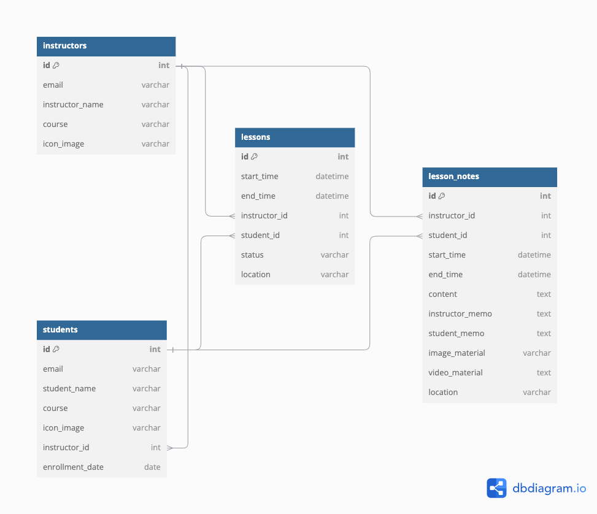

# Lesson Board
 
**Lesson Board**は、個人の音楽教室運営をサポートするWebアプリケーションです。<br>
レッスン管理や生徒とのコミュニケーションを効率化するための機能を提供します。

 ※ポートフォリオとして現在開発中です。 

音楽教室を運営する妻の助けになれば、と思いのもと
また、自分の音楽講師の経験も踏まえて制作をしています。
 
---

## URL

[Lesson Board](http://54.92.39.204/)

現在httpのみですが、httpsも導入予定です。

---

## アプリケーション概要

**Lesson Board**は、以下のように活用できます：

- 講師の方　レッスンスケジュールやレッスンノートの管理・共有、生徒管理  
- 生徒の方　自分のレッスン予定やレッスンノートの確認

#### 主な機能

- 講師&生徒ユーザー登録・ログイン（Devise使用）
- レッスンスケジュール管理（FullCalendar使用）
- レッスンノートの共有

---

## 使用技術

| 技術               | 詳細                                |
|--------------------|-------------------------------------|
| **Ruby on Rails 7** | アプリケーションのフレームワーク |
| **AWS EC2**         | デプロイ先     |
| **AWS RDS**         | 本番環境のデータベース              |
| **AWS S3**          | 画像ファイルのアップロード先          |
| **GitHub Actions**  | CI/CDパイプライン                  |
| **Docker**          | 開発環境のコンテナ化                |
| **MySQL**           | 開発環境のデータベース              |
| **FullCalendar**    | レッスンスケジュールの視覚化         |
| **Bootstrap 5**     | スタイリングとレスポンシブデザイン   |

---
## ER図

---

## セットアップ手順

### 前提条件

このプロジェクトを実行するためには、以下がインストールされている必要があります：

- **Docker**（推奨：最新の安定版）
- **Docker Compose**（推奨：v2.31.0 以降）

### 手順

#### **1. リポジトリをクローンする**

まず、GitHubからプロジェクトをクローンします：

```
git clone https://github.com/T-tak2023/LessonBoard.git
```
プロジェクトディレクトリに移動します：
```
cd LessonBoard
```

#### **2. サーバーの起動**

サーバーを起動します：
```
docker compose up  
```
#### **3. データベースの作成とマイグレーション**

データベースを作成し、マイグレーションを実行します。これにより、データベースのテーブルが作成されます：
```
docker compose run web rails db:create
```
```
docker compose run web rails db:migrate  
```
#### **4. 初期データの挿入（シード）**

シードファイルを使用して、サンプルデータをデータベースに挿入します：
```
docker compose run web rails db:seed  
```

#### **5. ローカルホストにアクセス**
ブラウザで以下のURLにアクセスしてください：

http://localhost:3000  

---
## ブランチ戦略 & CI/CD

### 1. メインブランチと作業ブランチ
- `main` ブランチは安定した状態を保つブランチとして扱います。  
- 新しい機能の開発やバグ修正は、`main` ブランチから作業ブランチを作成して行います。  
- 作業中に別の対応が必要になった場合は、さらにサブ作業ブランチを切り分けます。  

### 2. デプロイ（CI/CD）
このプロジェクトでは、**GitHub Actions** を用いた **CI/CD パイプライン** を採用しています。

- プッシュ時、およびプルリクエストがマージされた際に自動デプロイが行われます。  
- **Rubocop** と **RSpec** によるコードチェックを通過しない限り、デプロイは実行されません。  
- EC2 上で `docker-compose` を使い、コンテナをデプロイ・管理します。。  

#### **CI/CD の流れ**
##### **1. テスト・Lint チェック**
- `docker-compose` でコンテナを起動し、`RSpec` でテストを実行  
- `Rubocop` による Lint チェック  
- **どちらかが失敗した場合、デプロイは中止される**  

##### **2. デプロイ処理**
- EC2 のセキュリティグループに GitHub Actions 実行環境の IP を一時的に許可  
- EC2 に SSH 接続し、対象ブランチを取得  
- `docker-compose.prod.yml` を使ってコンテナを再構築・起動  
- `rails assets:precompile` を実行し、アセットをプリコンパイル  

##### **3. 後処理**
- EC2 のセキュリティグループから GitHub Actions の IP を削除  

### 3. マージ戦略
作業が完了したら、以下のルールに従ってマージを行います。  

- **作業ブランチ** → `main` ブランチ  
- **サブ作業ブランチ** → 元の作業ブランチ  

### 4. コミットメッセージ
コミットメッセージは **英語** で記述し、feat:, fix:などのプレフィックスを使用しています。  

- 変更の内容が複雑な場合は、**ヒアドキュメント** を活用し、複数行の説明を記載します。  
---

## 機能詳細

### 講師ユーザー

#### 講師アカウント管理
- アカウント作成、編集、削除

#### 講師プロフィール管理
- プロフィールの表示、編集

#### 生徒アカウント管理
- 生徒の登録、表示、編集、削除

#### レッスンカレンダー
- カレンダー上でレッスンの作成・編集・削除が可能

#### レッスンノート
- レッスンの記録。メモや画像資料、動画資料を生徒と共有

---

### 生徒ユーザー

#### プロフィール管理
- プロフィールの表示、編集

#### レッスン予定
- 今後のレッスン予定を一覧表示

#### レッスンノート
- レッスン内容や画像資料・動画資料を閲覧、メモの共有

---

## 今後の課題

- RSpecテストコードの作成

---

## さらに先の課題

- レッスンノートの検索機能追加
- 一覧表示のページネーション追加
- レッスン調整機能の追加（日程調整API等の導入の検討）
- 月謝支払い状況の記録・支払い機能

---

READ MEも随時更新予定です。
ご覧いただきありがとうございます。
